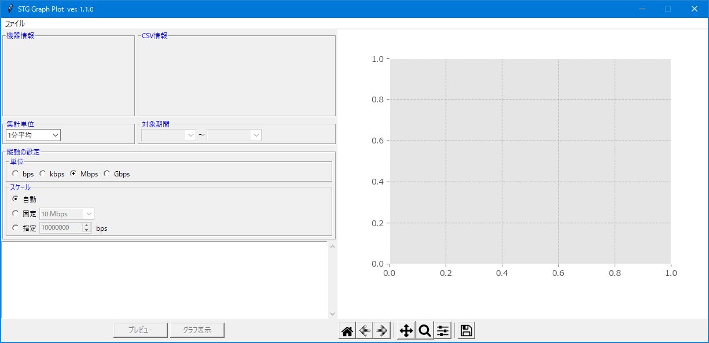

# STG Graph Plot

[SNMP Traffic Grapher](http://leonidvm.chat.ru/)で保存したCSVファイルを読み込み、グラフ化します。  
STG Version 1.4.5で動作確認しています。

## 使用言語、拡張ライブラリ

- Python（3.7.2で作成、3.9.4でも動作することは確認済み）
- Pandas（1.2.4で確認、たぶん最新版で問題ない）
- Matplotlib（3.4.1で確認、たぶん最新版で問題ない）

## 特徴

- ローテーションして保存した複数ファイル（*.csv,*.csv.000）をまとめて読み込み可能
  - データはトラフィックデータ（Byte数）である前提で読み込みます。
  - OIDを変更してCPU負荷などを取得していても、トラフィックデータとみなして処理します。
- 出力期間（日単位）、集計単位（平均時間）、縦軸スケール（単位、高さ）を指定できます。
- グラフ出力はMatplotlibの仕様に依存しています。
- グラフ出力時にCSVをファイルを出力します。
- SNMP Trafific Grapherの出力CSVファイルは、8月（Aug）がAvgになっているので、プログラム内で置換してから日付として読み込んでいます。（元ファイルは変更しません。）

## 使用方法

1. プログラムを起動します。次のようなウィンドウが表示されます。

    

2. `ファイル読込`ボタンを押し、CSVファイルを指定します。（複数ファイル指定可能）  
   読込が完了すると図の用になります。

    

3. `集計単位`、`対象期間`、`縦軸の単位`、`スケール`を設定します。
4. `グラフ表示`ボタンを押すとグラフ表示されます。

    

5. 保存したい場合はグラフウィンドウの下段にあるツールバーの右端ボタンを押してください。
