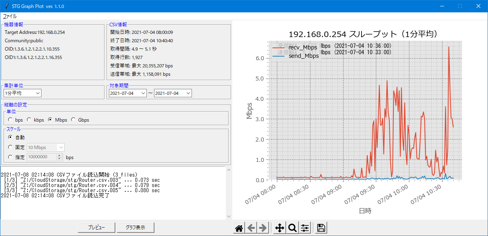
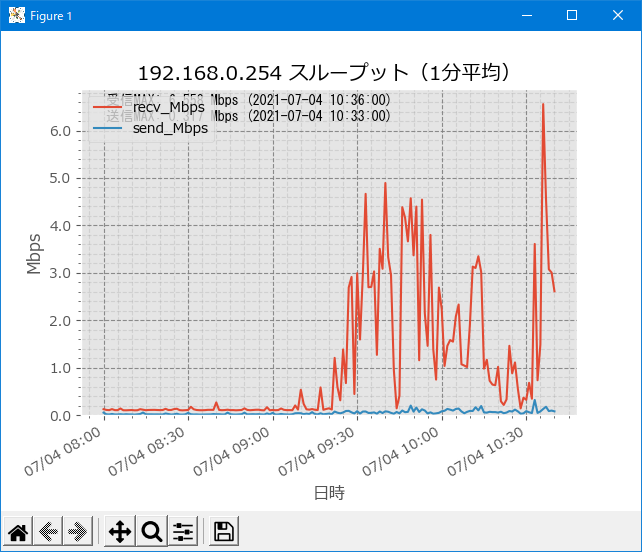

# STG Graph Plot

[SNMP Traffic Grapher](http://leonidvm.chat.ru/)で保存したCSVファイルを読み込み、グラフ化します。  
STG Version 1.4.5で動作確認しています。

## 使用言語、拡張ライブラリ

- Python（3.9.4で動作確認）
- Pandas（1.2.4で動作確認）
- Matplotlib（3.4.2で動作確認）

## 特徴

- STGの出力CSVファイルに対し、ローテーションして保存した複数ファイル（*.csv,*.csv.000）をまとめて読み込み可能
  - データはトラフィックデータ（Byte数）である前提で読み込みます。
  - OIDを変更してCPU負荷などを取得していても、トラフィックデータとみなして処理します。
- 出力期間（日単位）、集計単位（平均時間）、縦軸スケール（単位、高さ）を指定できます。
- グラフ出力はMatplotlibの仕様に依存しています。
- CSVファイルに出力することができます（メニューから選択）
- SNMP Trafific Grapherの出力CSVファイルは、8月（Aug）がAvgになっているので、プログラム内で置換してから日付として読み込んでいます。（元のCSVファイルは変更しません。）

## 使用方法

1. プログラムを起動します。次のようなウィンドウが表示されます。

    

2. `ファイル`メニューから`CSVファイル読込`を選ぶとファイルダイアログが開くので、CSVファイルを指定します。（複数ファイル指定可能）  
   読込が完了すると図の用になります。

    

3. `集計単位`、`対象期間`、`縦軸の単位`、`スケール`を設定します。

4. `プレビュー`ボタンを押すと、指定条件でグラフが表示されます。

5. `グラフ表示`ボタンを押すと、別ウィンドウでグラフが表示されます。

    

    必要に応じツールバーを操作して、ウィンドウサイズの変更、グラフ表示エリアの変更、余白調整等を行ってください。

6. 画像ファイルとして保存したい場合は、ツールバーの右端ボタン（フロッピーマーク）を押してください。

7. CSVファイルで出力した場合は、`ファイル`メニューから`CSVファイル出力`を選択してください。
